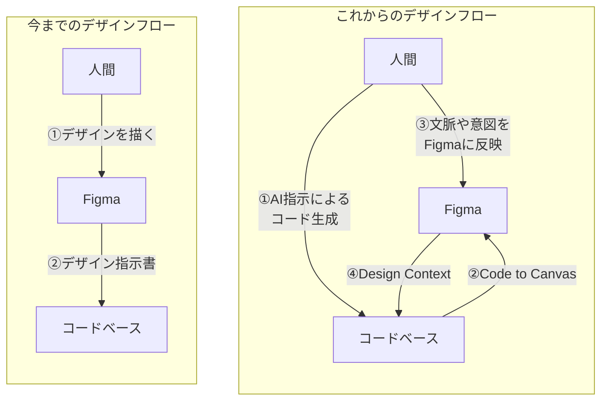

:::message
本記事は、[『試して学ぶ Figma MCPサーバー AIを活用したプロダクト開発』](https://www.amazon.co.jp/dp/4839990328/)の著者が、書籍には書き記せなかった内容を補足するために著者自身が手作業で執筆したものです。

本記事の内容は、著者の個人的な見解であり、著者が所属する会社の公式見解ではありません。
また、特定のSNS投稿や投稿者を否定するものではなく、Figmaを活用したデザインプロセスの考察を目的としています。

本記事で使用している画像は、Google Geminiのnano banana 2を使用して生成されています。
:::

## はじめに

先日、Xでは「[Figma不要論](https://x.com/i/trending/2029136081765974181?s=20)」が話題になっており、多くのデザイナーやエンジニアに衝撃を与えました。

> Figmaは100%不要。

https://x.com/kawai_design/article/2029115059251888431

Claude Codeやv0などの生成AIツールが進化し、自然言語で直接コードを生成できるようになった現在、
人間が実装するための指示書としてFigmaで絵を描く作業は、非常に効率が悪く、ボトルネックになっているという主張には一理あります。

「作業効率」という観点だけで見れば、**「Figma不要論」は完全に正しい** と言えるでしょう。
しかし、それでもなお **Figmaを捨てるのはまだ早い。かもしれない。** と私は考えています。

なぜなら、AIはまだ「りんご」の味を知らないからです。

## なぜAIが生成したデザインはAIっぽいのか

AIでコードを生成することが当たり前になった昨今、AIに自然言語で指示を出すと数十秒でそれらしいデザインが出力されます。
しかし、そのデザインを見て「なんとなく無難なデザインだな」「どこかで見たことがあるな」と感じることが多いのではないでしょうか。
見た目は整っているのに、どこかAIっぽいデザインに見えてしまうのです。
この違和感には **「記号接地問題（Symbol Grounding Problem）」** が関係していると考えています。

### AIは「りんご」の味を知らない

**「記号接地問題（Symbol Grounding Problem）」** とは、認知科学者のスティーブン・ハルナッド（Stevan Harnad）が1990年に提唱した概念で、「記号（言葉やデータ）」が「現実世界の意味（対象物や状態）」と結びついていないという問題です。AIは膨大なテキストデータの統計的なパターンを学習していますが、その記号は現実世界に接地していません。

*「りんご」という記号における人間とAIの認識の違い*

例えば、私たち人間が「りんご」という言葉を聞くと、赤くて丸い形状だけでなく、シャキシャキとした食感、甘酸っぱい味、手に持ったときの重さ、風邪を引いた時に母が剥いてくれたりんごの記憶といった身体的・文脈的な経験を想起できます。

一方、AIにとっての「りんご」は、単なるテキストデータ上の記号に過ぎません。
「りんご」は「赤い」「果物」「甘い」といった他の記号と統計的に強く結びついていることは知っていますが、現実世界のりんごを味わったことも、触れたことも見たこともありません。

### AIは「意味」を理解していない

「強いAI」に批判的な哲学者のジョン・サール（John Searle）が1980年に発表した思考実験 **「中国語の部屋」** でもAIは「意味」を理解しないことが示唆されています。

**「中国語の部屋」**という思考実験では、ある部屋の中に、中国語を全く理解できない人がいます。
部屋には中国語の文字をどのように組み合わせれば答えが出せるかが記されたマニュアルが置いてあり、そのマニュアルに従って答えを出すことができます。
部屋の外から中国語で書かれた質問が投げ込まれると、中の人はマニュアルに従って答えを出し、部屋の外に回答を返すことができます。

部屋の外の人から見れば、部屋の中には「中国語を完璧に理解している人」がいるように見えます。
しかし実際には、中の人は記号（中国語の文字）を操作しているだけで、その意味（中国語の内容）は一切理解していません。

*中国語の部屋（ジョン・サールの思考実験）のイメージ*

近年、生成AIの活用法として幅広く紹介されているプロンプトエンジニアリングは、**「中国語の部屋」にあるマニュアルの精度を高めるようなアプローチ** であり、AIに本質的な意味を理解させるようなアプローチではありません。
AIは膨大な学習データから記号と記号の関係性を学習し、流暢なアウトプットを出せますが、それはあくまで統計的な確率に基づいた記号操作であり、「意味」を理解しているわけではありません。

### 統計的平均への収束

これらの「記号の接地」や「意味の理解」の欠如は、デザイン生成のプロセスにおいて **「統計的平均への収束」** として現れます。

AIは学習データの中で **統計的に頻出するパターン** を優先して出力します。
AIが生成するデザインは、「ヘッダーにはロゴとナビゲーションがあることが多い」「ボタンは角丸であることが多い」などの統計的に頻出するパターンを組み合わせたものになります。

しかし、AIが生成するデザインには「なぜその表現なのか」という文脈や意図が欠如しています。
「ユーザーがここで迷うから、あえて違和感のある色にする」「ブランドの反骨精神を表すために、セオリーを崩す」といった、現実世界の文脈や身体性に基づいた **文脈や意図** は消えてしまうのです。

## 誰でもコード生成できる時代だからこそ、デザインでしか差がつかなくなる

FigmaのVP of ProductであるSho Kuwamoto氏は、2025年12月のインタビューで、次のように述べています。

> 「もし10社が同じアイデアを持っていて、その10社すべてが同じスピード感でコードを書けるとしたら、差別化できるポイントは『デザイン』になります」

https://webdesigning.book.mynavi.jp/article/25666/

これは非常に示唆に富んだ指摘です。

**「Figma不要論」は、コード生成が速いからFigmaは不要** というロジックです。

しかし、Sho Kuwamoto氏の視点は逆であり、**コード生成が速すぎて誰でも作れるようになったからこそ、デザインでしか差がつかなくなる** ということです。

コードを生成するコストがゼロに近づく時代において「どう体験させるか」をデザインする価値は相対的に上がります。
AIが生成した80点のデザインに対し、人間が文脈や身体性を付与して100点のデザインに仕上げる。その20点分の試行錯誤を行うために人間とAIが共創できる場として、まだまだFigmaは必要になるのではないかと考えます。

## FigmaはAIに文脈や意図を伝えるためのツール

Figmaは、「絵を描くだけのツール」から、「人間の持つ文脈や意図を構造化し、AIに伝えるためのツール」へと変化していると推察します。
実際、近年のFigmaの機能追加は、記号の接地を補助する方向に向かっているように思います。

### [Annotation](https://help.figma.com/hc/ja/articles/20774752502935-%E9%96%8B%E7%99%BA%E3%83%A2%E3%83%BC%E3%83%89%E3%81%A7%E3%81%AE%E6%B8%AC%E5%AE%9A%E5%80%A4%E3%81%AE%E8%BF%BD%E5%8A%A0%E3%81%A8%E3%83%87%E3%82%B6%E3%82%A4%E3%83%B3%E3%81%B8%E3%81%AE%E3%82%A2%E3%83%8E%E3%83%86%E3%83%BC%E3%82%B7%E3%83%A7%E3%83%B3%E4%BB%98%E3%81%91)

Figma Designに搭載されているアノテーション機能は、デザインレイヤーに直接注釈を付けることで、現実世界の文脈や意図をデザインのコンテキストとしてFigma MCPを通してAIに渡すことができます。
これはデザイン記号の接地を補助するための重要なツールです。

### [Code Connect](https://help.figma.com/hc/ja/articles/23920389749655-Code-Connect)

Code Connectは、デザイン上のコンポーネントとコードベースのコンポーネントをマッピングする仕組みであり、Figma MCPを用いてコードを生成する際に使用すべきコンポーネントをAIが正確に特定できるようになります。
「このFigma上の青い四角は、Reactの `<Button />` コンポーネントである」という定義を人間が与えることで、AIは統計的な推測に頼らず、正確に対応するコンポーネントを特定してコードを生成できるようになります。

### [Code to Canvas](https://www.figma.com/blog/the-future-of-design-is-code-and-canvas/)

興味深いのが、**Code to Canvas** というアプローチです。

HTMLはもともと `<h1>`（見出し）、`<button>`（ボタン）といった構造的な意味を持っています。
この実装上の記号を正しい意味として解釈し、そこからFigma上にデザインを生成することで、見た目だけでなく、構造に基づいたデザインが生成されやすくなります。
これは、コードベースにある「構造的意味」を、デザインの「視覚的な記号」に変換し、記号の接地を補助するアプローチと言えます。

## 結論：Figmaは人間とAIが共創する最適なツール

「実装のための指示書」としてのFigmaは、確実に役割を終えつつあります。「Figma不要論」が示すように **エンジニアに渡すデザイン指示書のためだけにデザイナーが複雑なAuto Layoutを駆使してボタンを再現するのは非効率** です。

しかし、「人間とAIが共創する最適なツール」としてFigmaは、これからも必要になります。
すべてをAIに任せたデザインでは記号が接地していない「AIっぽい」デザインしか出力されません。
現実世界の「文脈や意図」に接地させたデザインに仕上げるのは、依然として人間の役割です。これからのFigmaは、**AIの出力に対して人間が直感的に介入し、「文脈や意図」を付与するための共創を支援するツール** になるはずです。

**「Figma不要論」は、まだ早い。かもしれない。**
少なくとも、AIが「りんご」の味を本当に理解し、自らの意志でそれを表現できるようになるまでは。
